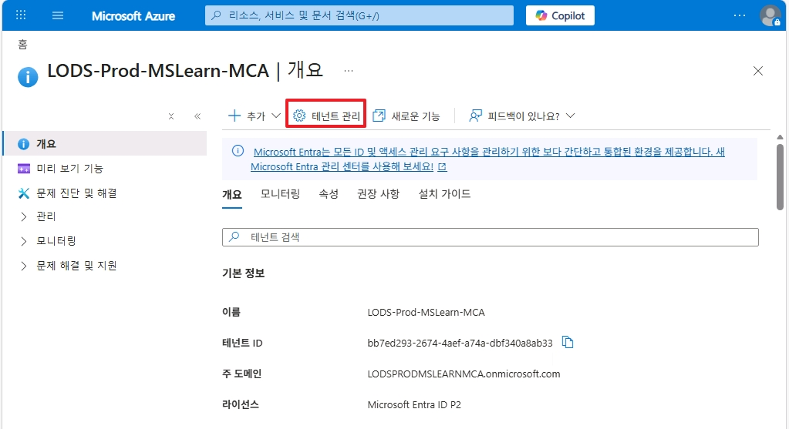
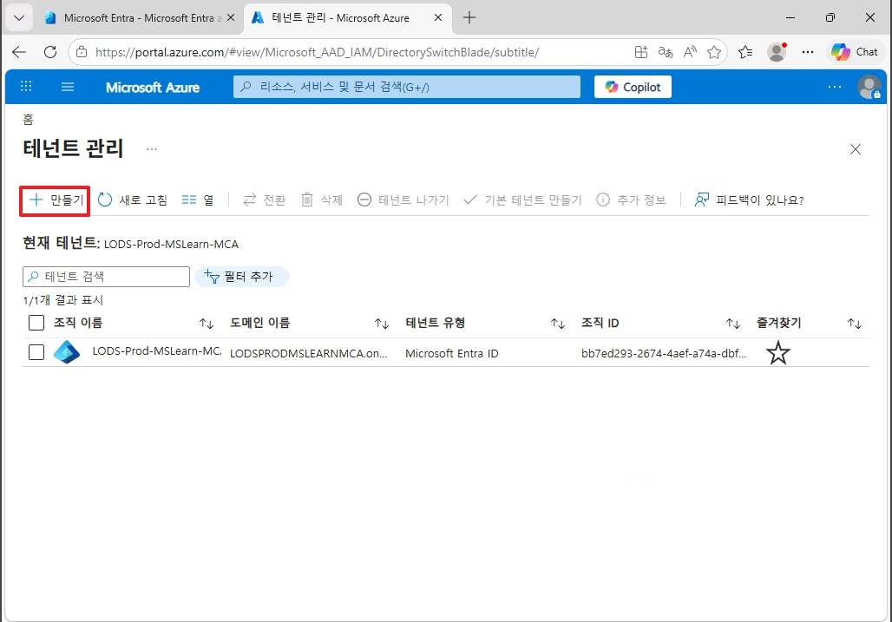
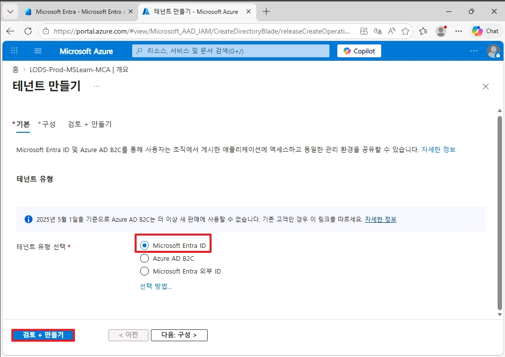
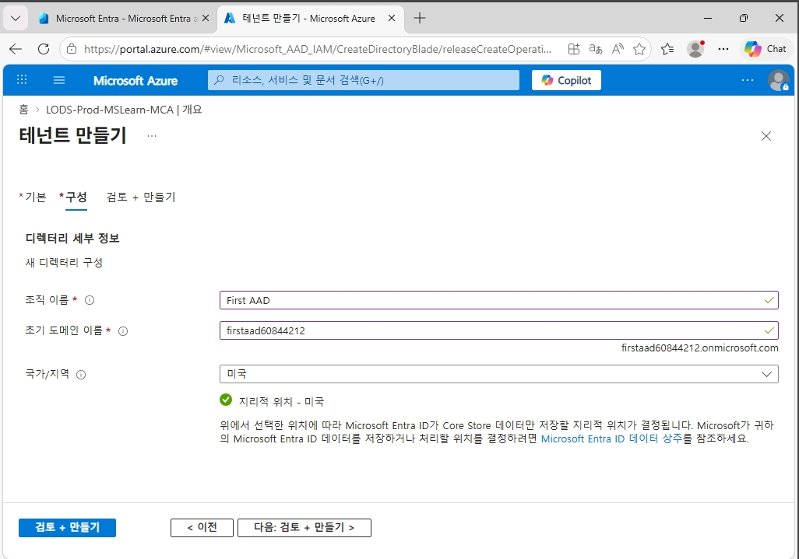
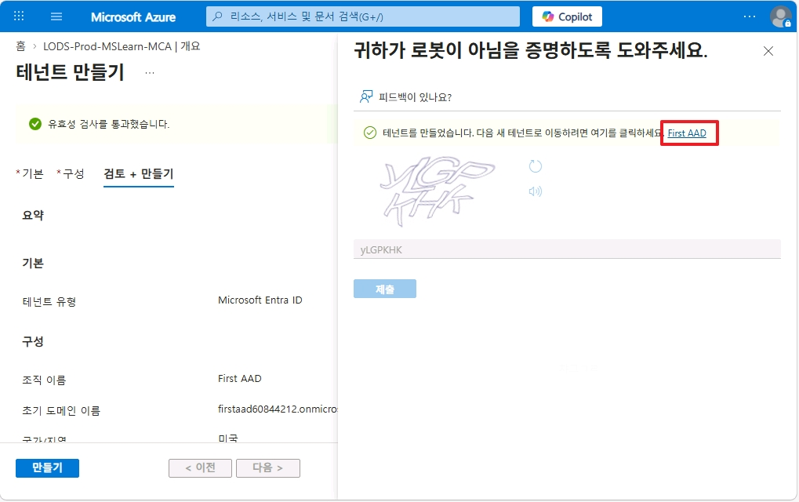
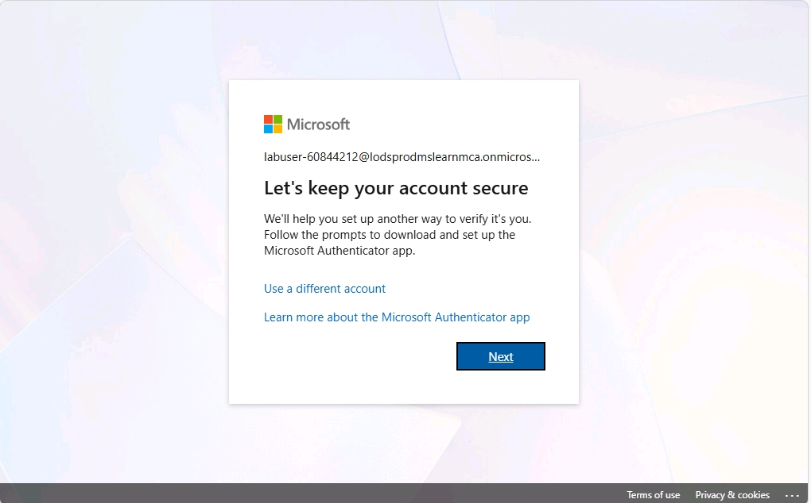
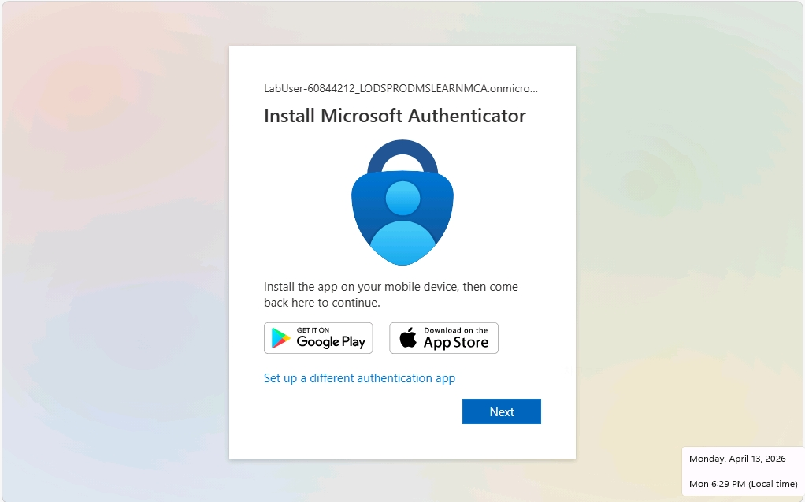
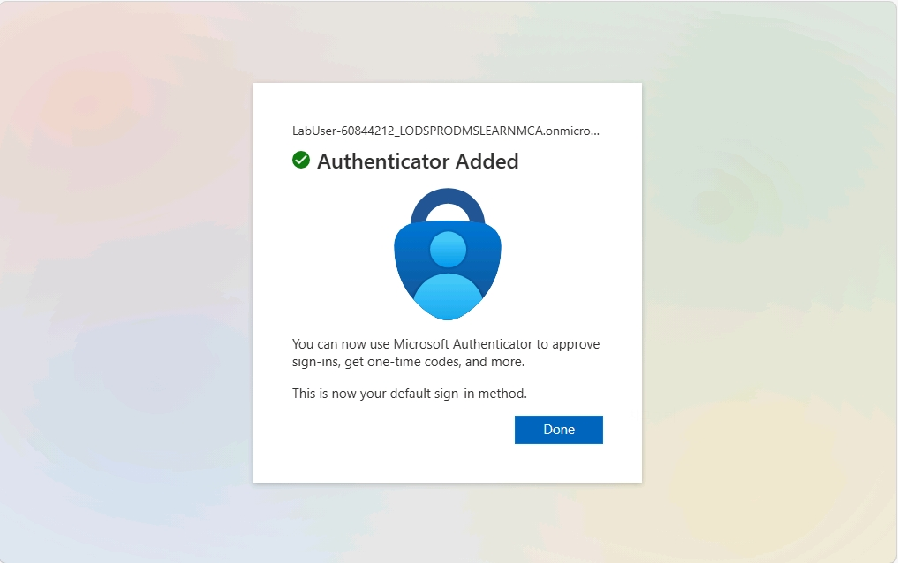
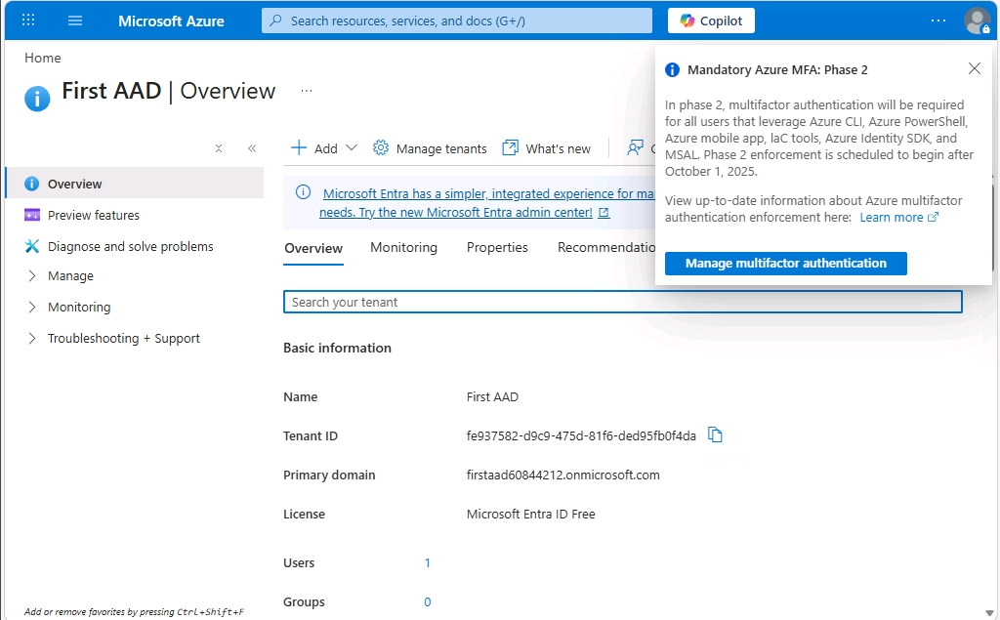

# 1. 신규 Entra ID 생성

### 1. 테넌트 관리 클릭

* `Microsoft Entra ID` 메뉴로 이동한 후, 테넌트 관리를 클릭합니다.

 

### 2. 테넌트 만들기

* 신규 테넌트를 생성하기 위하여, `+ 만들기` 버튼을 클릭합니다.

 

### 3. Microsoft Entra ID 선택

 

### 4. 테넌트 구성 설정

* `테넌트 이름`과 `초기 테넌트 도메인명`을 설정합니다.

 

### 5. 테넌트 생성 및 신규 테넌트 접속

* 테넌트를 생성한 이후, 테넌트명을 클릭합니다.

 

### 6. 도메인 소유자 계정 MFA 추가  

 

### 7. Microsoft Authenticator 인증

 

### 8.  Microsoft Authenticator 인증 완료

 

### 9. 신규 테넌트 접속

 
