# 1.2 신규 사용자 생성
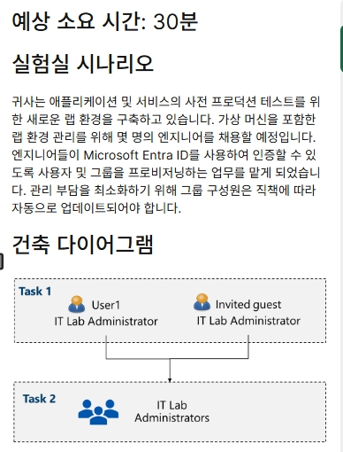

## 1. 신규 사용자 생성

### 1. 신규 사용자 만들기
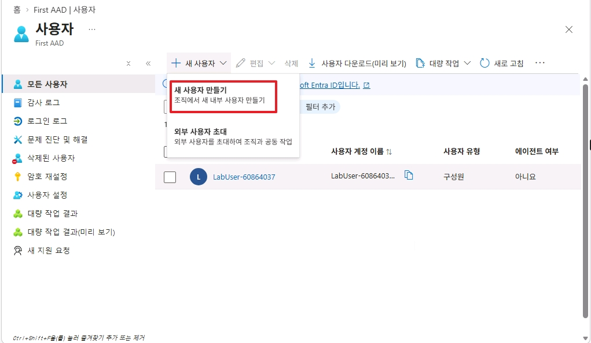
* `Microsoft Entra ID` 에서 사용자 탭으로 이동한 후, 새 사용자 만들기를 클릭합니다.

 

### 2. 사용자 기본사항 설정
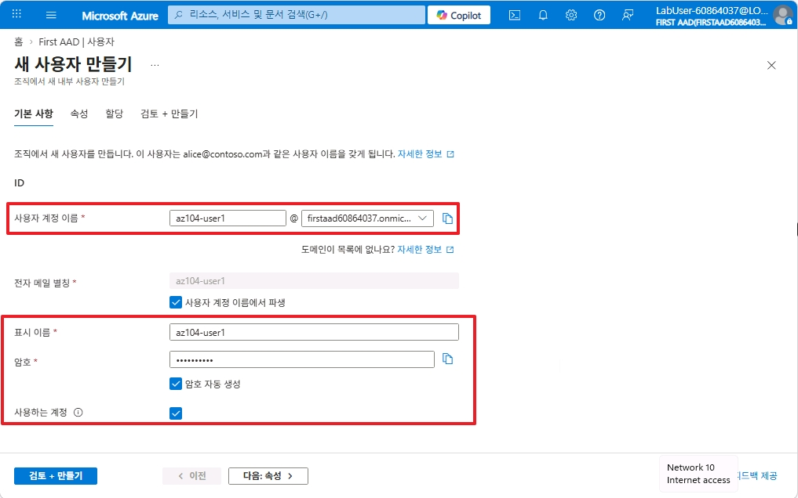
* 사용자 ID/PW와 표시되는 이름을 설정합니다.   

 

### 3. 사용자 세부 속성 설정
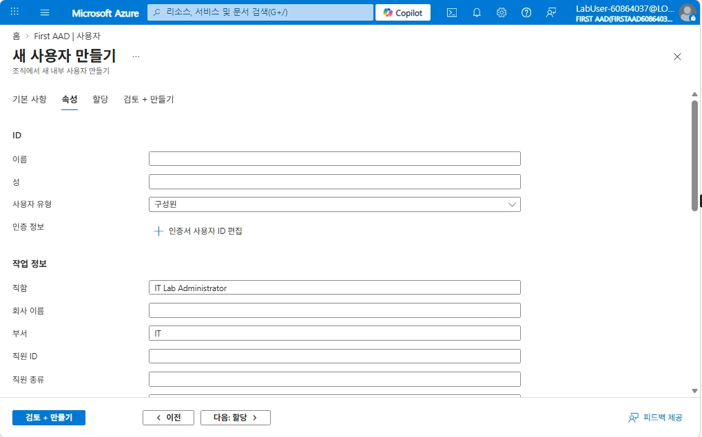
* 사용자의 부서 혹은 직함 등을 추가로 설정합니다. 

 

### 4. 새 사용자 생성
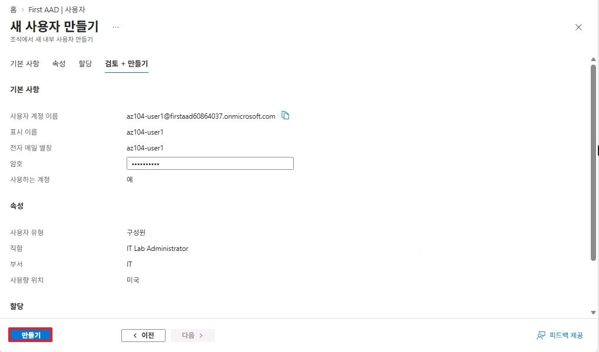
* 설정한 내용을 검토한 후, 신규 사용자를 생성합니다.  

 

### 5. 생성된 사용자 확인
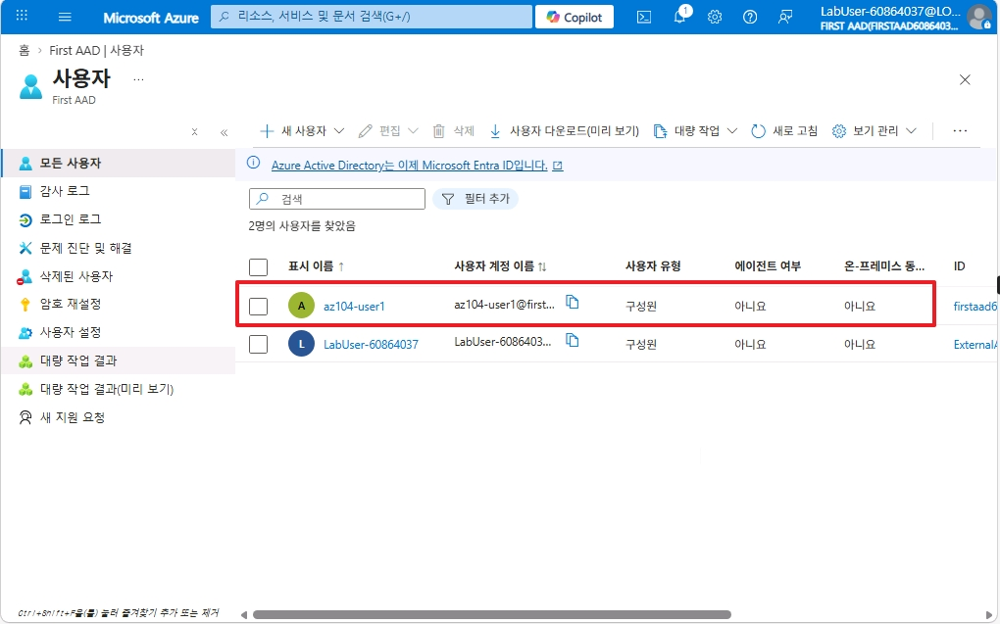
* 목록을 새로고침하여 생성된 사용자를 확인합니다.  

 

## 2. 외부 Guest 사용자 생성

### 1. 외부 사용자 초대
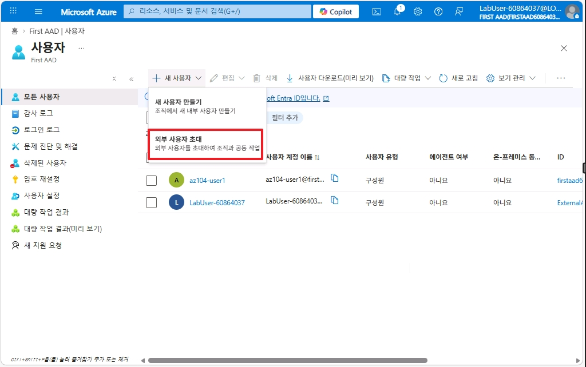
* `Microsoft Entra ID` 에서 사용자 탭으로 이동한 후, `외부 사용자 초대`를 클릭합니다.

 

### 2. 외부 사용자 초대 설정
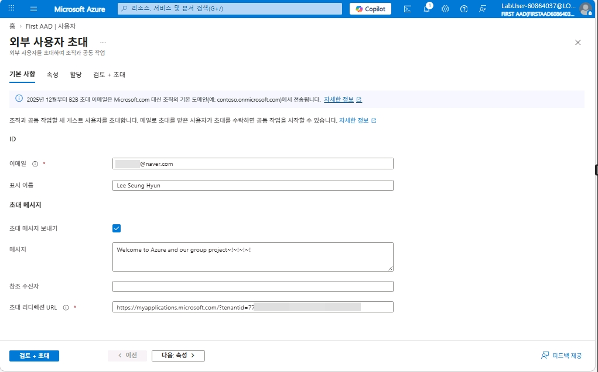
* 초대할 외부 사용자의 이메일 정보 및 추가 정보를 입력합니다.

 

### 3. 외부 사용자 세부 속성 설정
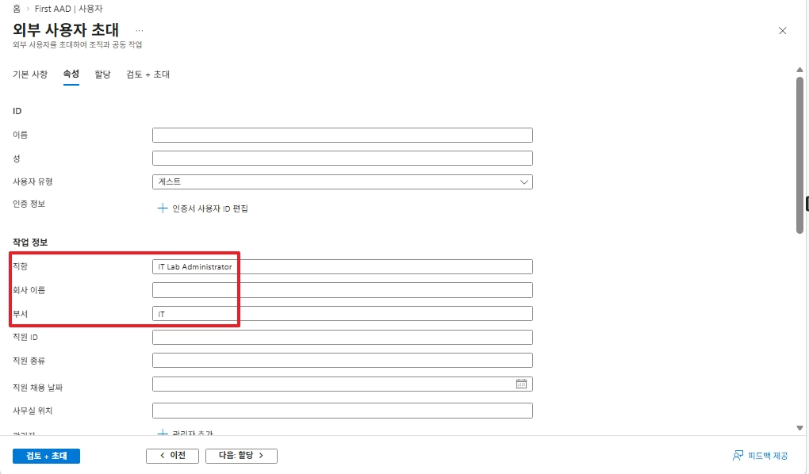
* 초대할 외부 사용자 계정의 직함 및 부서 정보 등을 추가합니다.  

 

### 4. 외부 사용자 초대
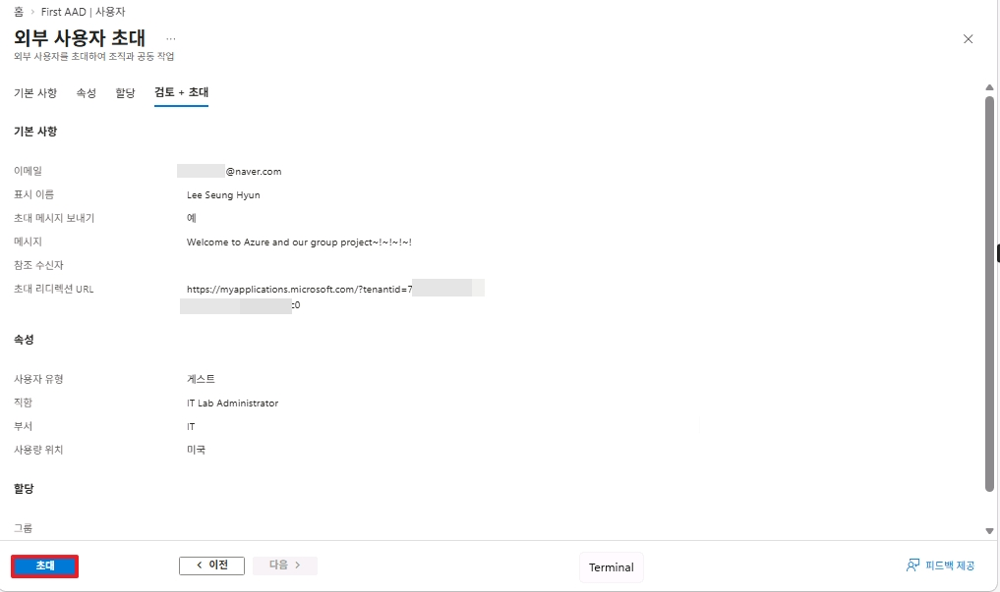

 

### 5. 외부 사용자 계정 생성
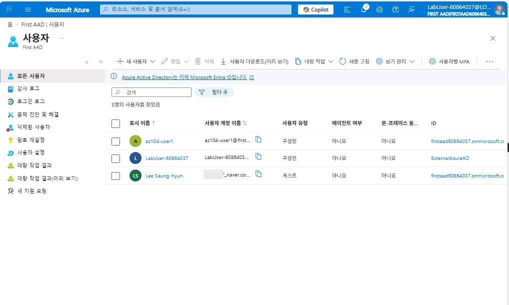
* 외부 사용자의 수락 여부와 상관 없이 바로 계정이 생성됩니다.  

 

### 6. 이메일 수락
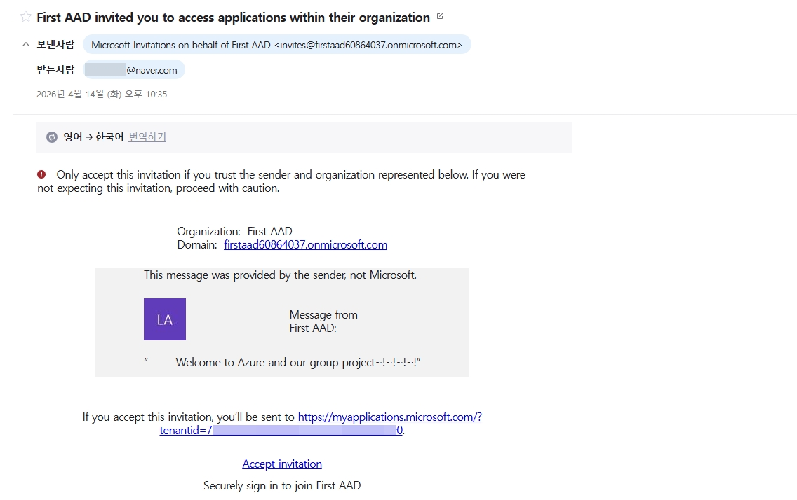
* 위와 같이 Entra 가입 이메일을 수신받게 됩니다.  

 

### 7. 권한 수락  
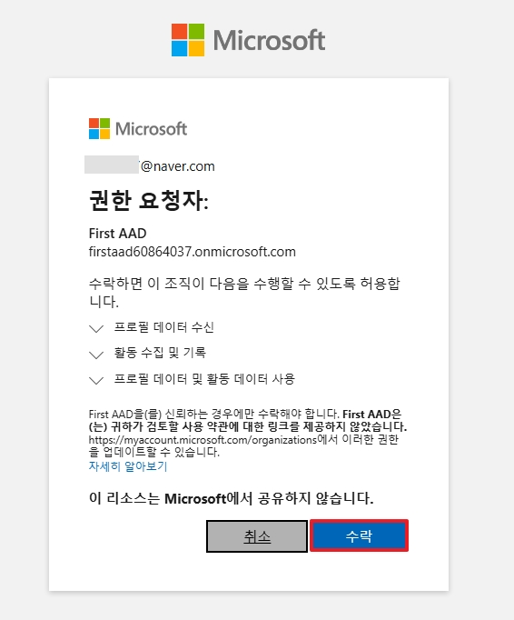

 

### 8. Entra 확인  
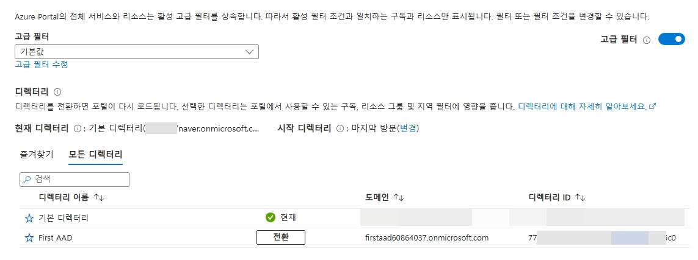
* 이미 Entra에 가입되어 있는 Microsoft Account 계정이라면 디렉토리 변경을 통하여 신규 가입한 Entra를 확인할 수 있습니다.  
