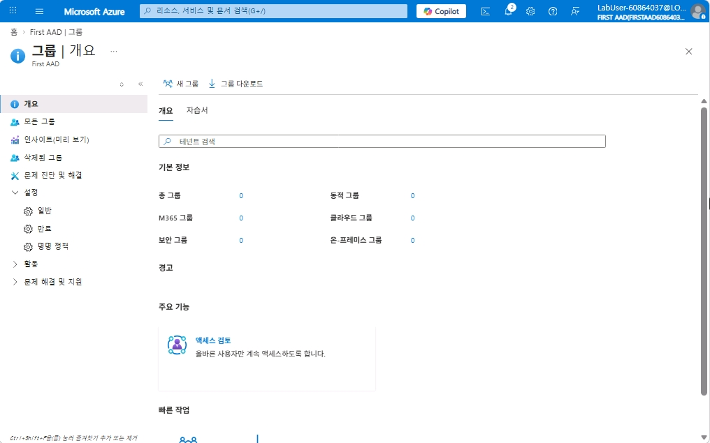
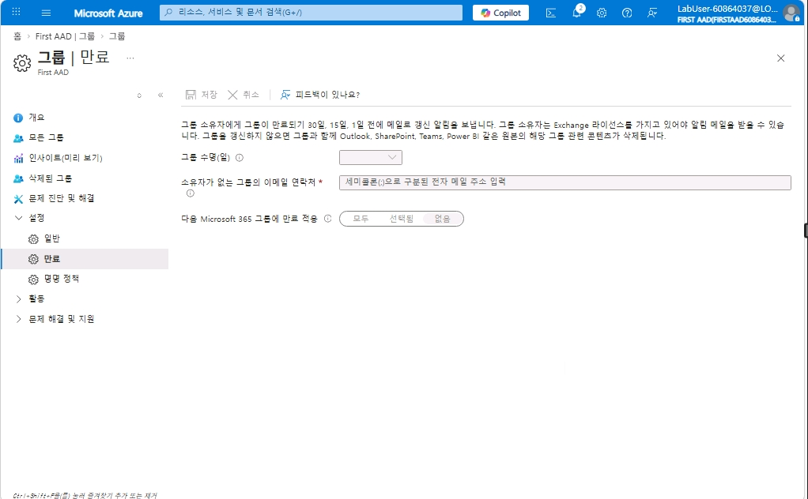
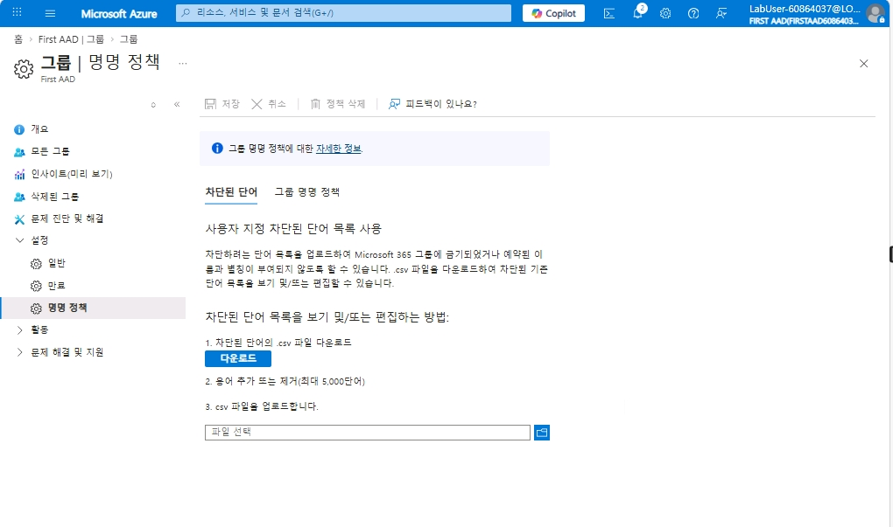
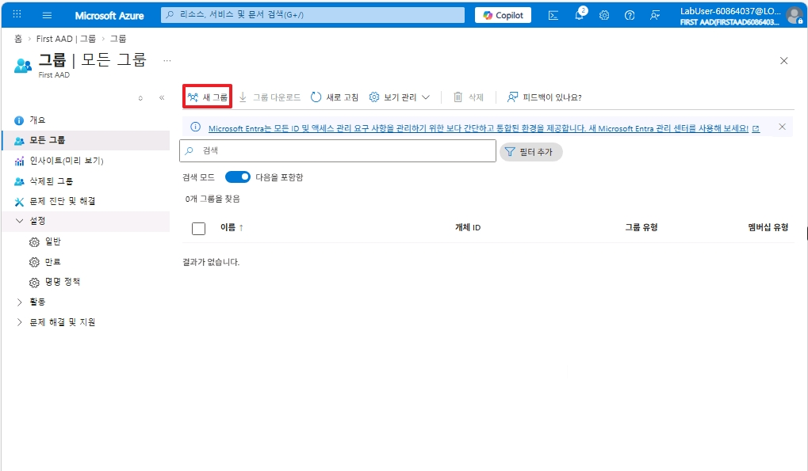
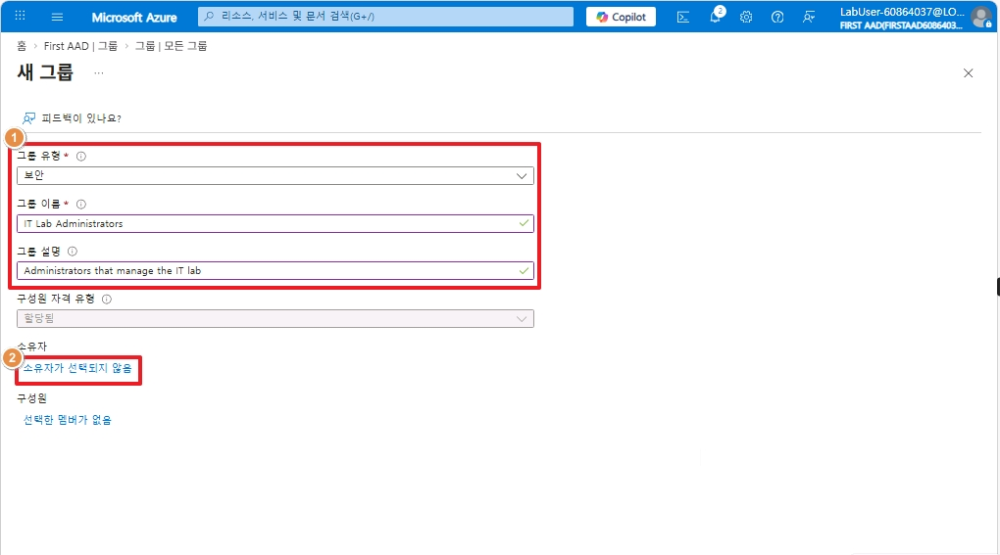
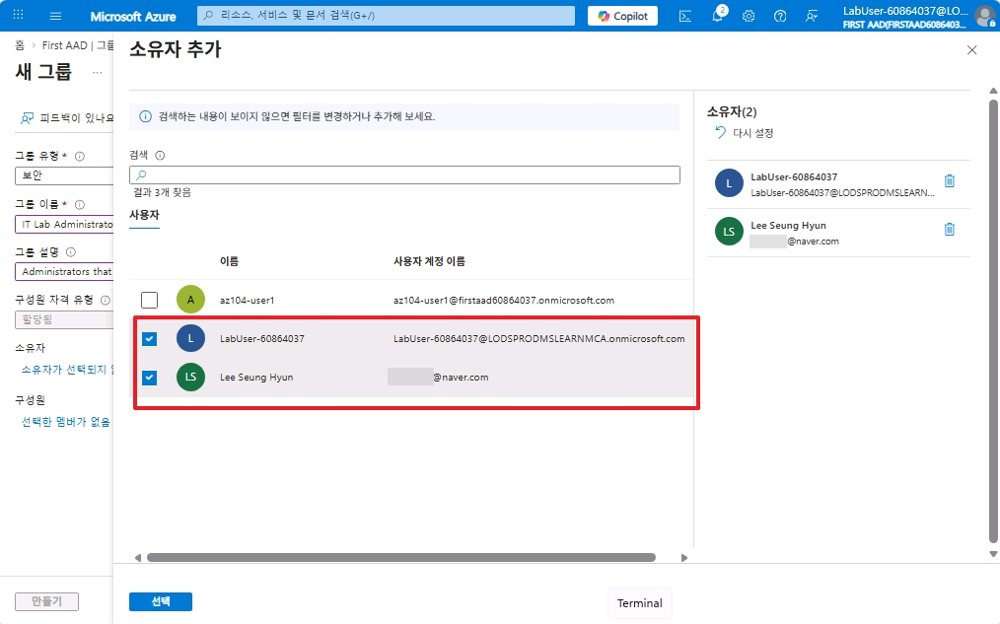
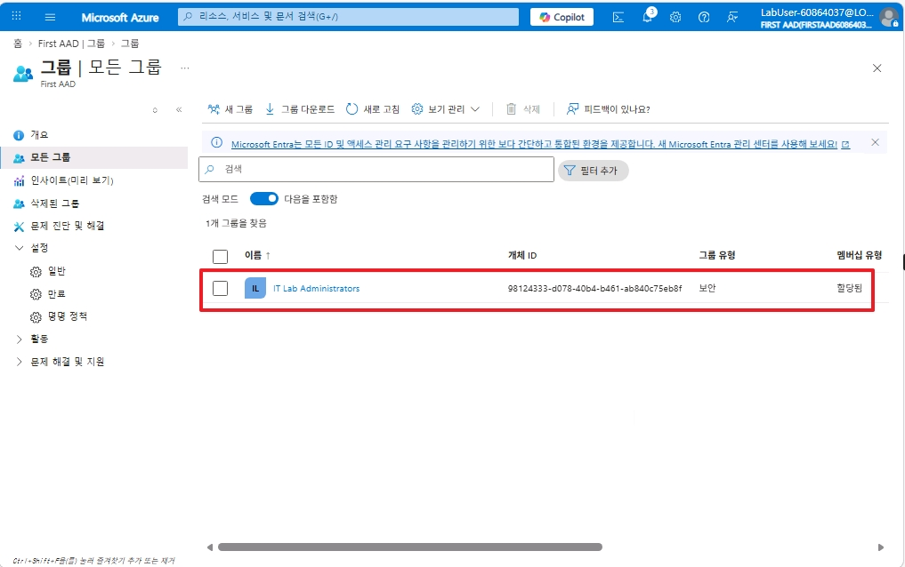

# 1.3 신규 그룹 생성

### 1. 그룹 이동

* `Microsoft Entra ID` 에서 그룹으로 이동합니다.

 

### 2. 그룹 만료 기능 확인

* 보안 그룹이 아닌 Microsoft 365 그룹은 그룹 수명이 사용이 가능합니다.
* Entra 라이선스는 P1, P2부터 사용이 가능합니다.  

 

### 3. Microsoft 365 그룹 명명 정책

* Microsoft 365 그룹 생성 시, 사용 불가능한 단어 차단 혹은 명명 규칙 등이 설정 가능합니다.  
* Entra 라이선스는 P1, P2부터 사용이 가능합니다. 

 

### 4. 새 그룹 생성

* `모든 그룹` 탭으로 이동한 후, 새 그룹을 생성합니다.  

 

### 5. 신규 그룹 설정

1. 그룹의 유형을 정한 후, 이름과 설명을 설정합니다.
    * 유형은 `보안 그룹`과 `Microsoft 365`이 있습니다.  
2. 해당 그룹의 소유자를 선택합니다.  

 

### 6. 그룹 소유자 선택 및 그룹 생성

 

### 7. 생성된 그룹 확인

 